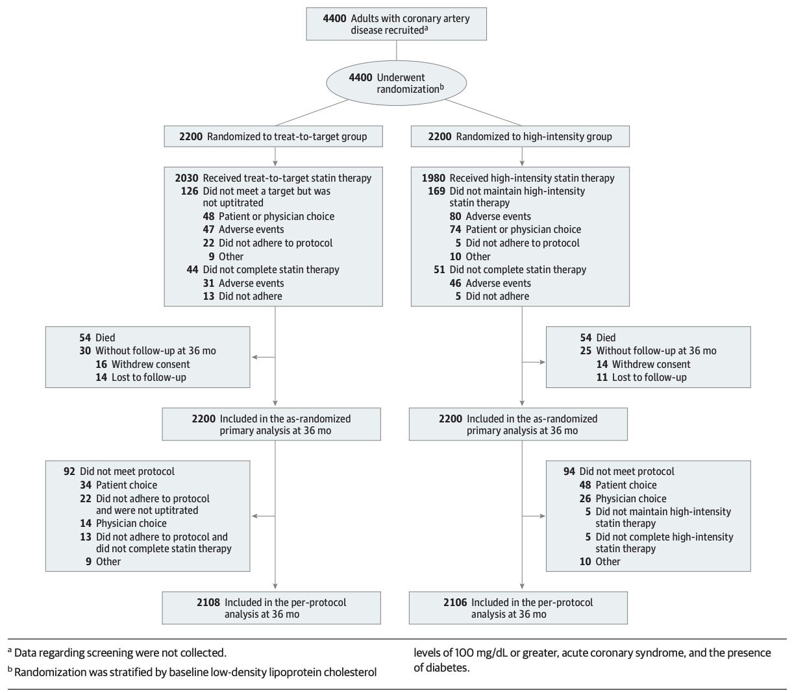
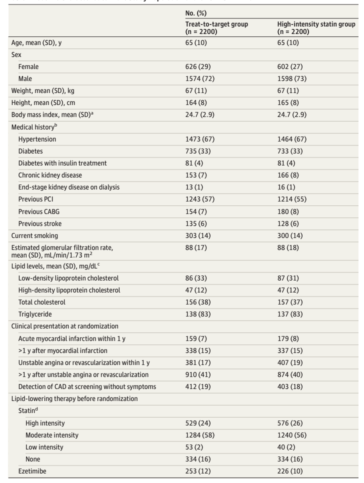
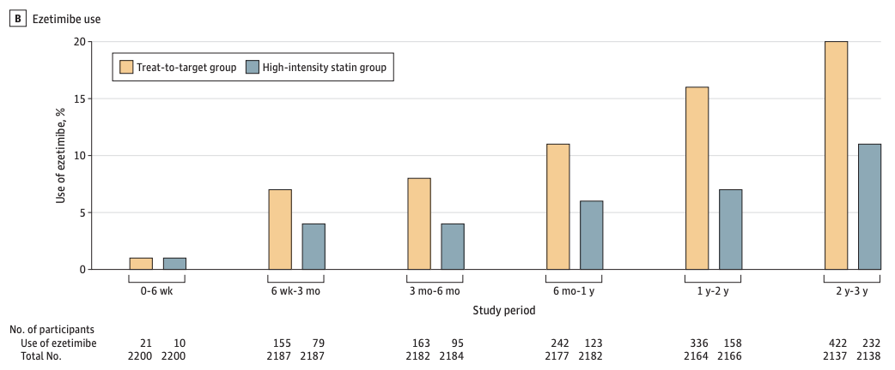
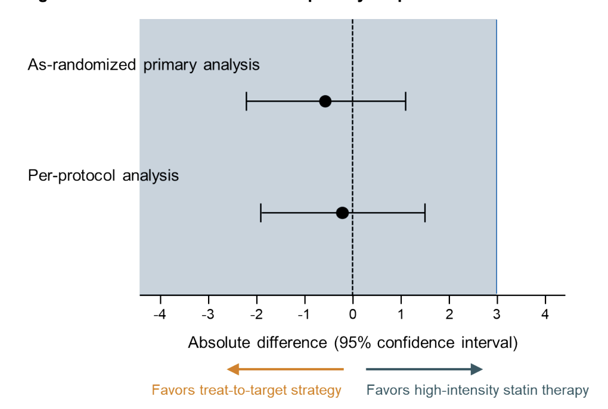

## Glossary

Treat-to-Target (T2T)

:   만성질환관리에서 구체적인 특정 치료목표를 미리 정해두고 도달시까지 적극적으로 조절 및 강화하는 의료 전략

Coronary Artery Disease(CAD)

:   관상동맥질환. 동맥경화 등으로 인해 관상동맥의 혈류가 불충분해져 발생하는 질환. 협심증, 심근경색증 등

## Background & Importance

-   심혈관 질환 발생위험이 높은 CAD 환자에게는 고강도의 statin 치료를 통해 LDL 콜레스테롤 수치를 최소 50% 이상 낮추는 것이 초기 지침.

    -   강도 조절 필요성이 줄어 간편하지만 약물 반응의 개인차와 고강도 statin 장기 사용으로 인한 부작용 우려

-   LDL-C 목표 수치에 도달할 때까지 중강도 statin에서 시작하여 용량 조절하는 T2T 전략이 대안 맞춤형 접근이 가능하며 의사-환자 간 소통을 원활하게 하여 치료 순응도를 높일 수 있음.

    -   RCT에서 충분히 평가되지 않아 근거 부족할 뿐더러, 이 두 방식이 CAD 환자 대상 임상시험에서 직접 비교된 적 없기에 이 연구가 의미를 가짐.

------------------------------------------------------------------------

-   **Objective** : CAD 환자 장기(3년) 임상결과에서 T2T방식이 고강도 statin 방식에 비열등한지 평가   

-   **Intervention** : LDL-C 수치 50\~70 mg/dL 목표의 T2T 그룹 혹은 Rosuvastatin 20mg/Atorvastatin 40mg의 고강도 statin 치료 그룹에 무작위 배정.  

-   **Primary Endpoint** : 사망, 심근경색, 뇌졸중 관상동맥 혈관재개통술의 3년 복합 발생률. (비열등성 한계치 3.0%p)

# Methods

## Study Design

2016/09/09 \~ 2019/11/27 한국 12개 기관에서 수행.

Multicentre / Randomized / Open-label ***Non-inferiority Trial*** ^1^

1.  두 치료군 간 primary endpoint 발생률 차이에 대한 단측 97.5% 신뢰구간 상한치가 3.0% 미만일 경우 비열등성이 입증된 것으로 정의.

## Study Population

### 선정기준

-   19세 이상

-   CAD를 임상적으로 진단받은 환자 : 안정형/불안정형 협심증. 급성 비ST분절상승 심근경색증. 급성 ST분절상승 심근경색증

-   서면 동의서에 서명

### 제외기준

-   연구기간 중 임산부 또는 임신가능성 있는 여성

-   statin에 대한 심각한 부작용 또는 과민반응이 있는 환자

-   statin과 상호작용하는 약물(Cytochrome P450 3A4 또는 2C9의 강력한 억제제) 복용중인 환자

-   근병증, 유전성 근육 질환, 갑상선 기능저하증, 알코올 사용 장애, 심각한 간 기능장애, 횡문근융해증의 위험 인자가 있는 환자

-   기대수명 3년 미만

-   1년 이상 추적 관찰 불가능한 환자

-   동의서를 이해할 수 없는 환자

## Randomization & Study Procedure

-   Randomization : 1:1 대응 방식, 웹 기반 블록 무작위배정 사용하여 두 치료방식 그룹에 배정. Rosuvastatin이나 atorvastatin의 두 statin 중 하나를 1일1회 투여받도록 1:1 무작위배정.

-   Sample Size : 3년 추적 관찰 시 발생률 각 12%로 추정. 비열등성 마진 3.0%, 단측 alpha 오차율 2.5%. 검정력 80%, 15%의 추적 관찰 탈락률

    -   총 4336명 환자 필요 (+ 두 종류의 Statin 균형 고려)
    -   최종 연구 대상 4400명

-   관찰

    6주,3,6,12,24,36개월에 추적 방문하여 전반적 상태와 약물 복용량, endpoint 평가 실시

    6주, 12,24,36개월에 지질 검사 통해 LDL-C 수치 추적 관찰

------------------------------------------------------------------------

------------------------------------------------------------------------

## Statistical Principles

-   범주형 데이터 : 백분율로 제시. 카이제곱 검정 혹은 피셔의 exact test 사용하여 비교

-   연속형 데이터 : 정규분포/왜곡된 분포에 따라 평균±표준편차 또는 중앙값으로 제시. 스튜던트 t-test 혹은 맨-휘트니 U test 사용하여 비교

-   Primary endpoint : 3년 시점에 누적 발생률 추정. 첫번째 interest 사건 발생까지 기준으로 Kaplan-Meier 곡선 도출. P-value \<0.05를 유의한 것으로 간주.

-   두 치료군 간 발생률은 로그 순위 검정으로 비교하며 95% 신뢰구간의 HR은 Cox 회귀분석을 통해 추정   

**Study population**

-   무작위 배정된 모든 집단을 포함하는 ITT 집단에서 수행됨. 할당된 치료를 받지 않은 환자들을 제외한 임상순응분석(PP) 집단에 대해서도 추가로 수행.

-   다만 다음의 3가지 경우는 제외 : 부작용 외 이유로 총 추적기간의 5%를 초과하여 치료 중단/ T2T 군에서 목표치 도달 실패에도 용량 증량하지 않음/ 고강도 statin 군에서 고강도 statin 유지하지 않음

## Settings

-   Statin 투여량

    중강도 Statin - Rosuvastatin 10mg or Atorvastatin 20mg

    고강도 Statin - Rosuvastatin 20mg or Atorvastatin 40mg

-   T2T 집단 투여방법

    Statin 처음 복용 시 중강도 투여로 시작, 이미 복용 중인 경우 랜덤 배정 시 수치가 70mg/dL미만이면 동일 강도 유지, 이상이면 강도 높임

-   고강도 Statin 집단 투여방법

    LDL-C 수치와 관계 없이 고강도 Statin 조정 없이 유지

-   추적 관찰 (양 군 공통)

    -   6주,3,6,12,24,36개월에 추적 방문하여 전반적 상태와 약물 복용량, endpoint 평가
    -   6주, 12,24,36개월에 지질 검사 통해 LDL-C 수치 추적 관찰
    -   이상반응 모니터링 위해 혈장 포도당, AST, ALT, 크레아티닌 및 크레아틴 키나아제 수치 6주, 12,24,36개월에 평가. 당화혈색소(HbA1c)는 12,24,36개월에 평가

## Study Endpoint

### Primary Endpoint

사망, 심근경색, 뇌졸중, 관상동맥 혈관재개통술의 3년 복합 발생률 (비열등성 한계치 3.0%p로 설정)

-   심혈관성 사망 : 심근경색, 급사, 심부전, 뇌졸중, 심혈관 시술, 심혈관 출혈로 인한 사망 및 심혈관 원인을 배제할 수 없는 모든 사망

-   심근경색 : 임상 증상, 심전도 변화 또는 영상학적 검사상의 이상 소견과 더불어 상한치 초과수준의 크레아틴 키나아제-심근 분획(CK-MB)증가 또는 상한치의 99백분위수 초과 수준의 트로포닌-T나 프로토닌-I 수치 증가가 동반된 경우

-   뇌졸중 : 24시간 이상 지속되는 신경학적 결손을 초래하는 급성 뇌혈관 사건 또는 영상학적 검사상 급성 경색의 존재

-   재개통술 : 허혈성 증상이나 징후가 있으면서 침습적 혈관 조영술상 직경 협착률이 50% 이상인 경우, 또는 증상이나 징후가 없더라도 직경 협착률이 70% 이상인 경우. 랜덤 배정 시 계획된 단계적 관상동맥 재개통술은 이상 사례로 간주하지 않음

------------------------------------------------------------------------

### Secondary Endpoints

1.  신규 당뇨병 발생
2.  심부전으로 인한 입원
3.  심부정맥 혈전증 또는 폐색전증
4.  말초동맥 질환에 대한 혈관 내 재개통술
5.  대동맥 중재술 또는 수술
6.  말기신질환
7.  불내성으로 인한 연구 약물 복용 중단
8.  백내장 수술
9.  검사 수치 이상에 대한 복합 지표

## Statistical Analyses

### Primary analysis

랜덤 배정된 모든 참가자 대상. 할당된 치료받지 않은 참가자들^1^은 제외

### Secondary analysis

연령, 성별, 체질량 지수, 고혈압, 당뇨병, 만성 신장 질환, 랜덤배정 시점의 임상적 상태 및 기저 LDL-C 수치 등 임상적으로 유의미한 요인들을 대상으로 수행. 약물 사용에 관한 데이터는 의사 처방 기록 통해 수집, 연구 약물에 대한 복약 순응도는 자기 보고식 알약 개수 확인 통해 측정.

-   데이터 누락 시 동의 철회나 추적 관찰 상실 시점에 중도 검열

-   모든 분석은 SAS 버전 9.2 사용하여 수행. 비열등성 검사 외 모든 검사는 양측 검정으로 진행. P-value\<0.05를 통계적으로 유의한 것으로 간주

# Results

## Flow Diagram

## Baseline Characteristics

------------------------------------------------------------------------

2016/09/09 \~ 2019/11/27 총 4400명 대상 - 각 치료법에 2200명씩 랜덤 배정.

-   그룹 간 참여자 baseline 차이는 없었으며 랜덤 배정 당시 참여자의 74%는 최초 진단 또는 관상동맥 재개관술을 받은지 1년 이상 경과한 상태였음. 배정 전에는 각각 25%와 57%의 참여자가 고강도 statin과 중강도 statin 복용 중

총 4400명 환자 중 4341명(98.71%)이 3년간 임상추적관찰 완료 (평균 65.1세, 여성 1228명),

총 추적관찰기간 T2T군 6449인년, 고강도 statin군 6461인년

------------------------------------------------------------------------

### **스타틴 강도 변경 (T2T군)**

|       |    증량     |    감량    |     유지     |
|:-----:|:-----------:|:----------:|:------------:|
| T2T군 | 378명 (17%) | 208명 (9%) | 1614명 (73%) |

전체 연구기간 동안 T2T군에서 중강도 43%, 고강도 54% 처방.

6개월 후부터는 고강도 군에 비해 T2T 군에서 ezetimibe가 더 많이 사용되었으며 대부분 고강도 statin과 병용요법이었음.

------------------------------------------------------------------------

### **고강도 스타틴 복용 비율**

|                 | 1yr | 2yr | 3yr |
|:---------------:|:---:|:---:|:---:|
|      T2T군      | 53% | 55% | 56% |
| 고강도 스타틴군 | 93% | 91% | 89% |

------------------------------------------------------------------------

### LDL-C 수치 비교

-   6주 차: T2T군 69.6±21.2 mg/dL vs 고강도군 66.8±21.8 mg/dL (차이 2.8; P \< .001)
-   **6주 이후에는 두 군 간 유의한 차이 없음**
-   3년간 평균: T2T군 69.1 mg/dL vs 고강도군 68.4 mg/dL (P = .21)

------------------------------------------------------------------------

### LDL-C \< 70mg/dL 달성률 (T2T 군)

| 시점 | 달성률 |
|:----:|:------:|
|  6w  | 55.7%  |
|  3m  | 59.2%  |
|  6m  | 57.7%  |
| 1yr  | 55.7%  |
| 2yr  | 60.8%  |
| 3yr  | 58.2%  |

-   6주, 3개월 차에는 고강도군보다 유의하게 낮았으나 이후 차이 없음

## Primary Endpoint

|                 |      T2T군       | 고강도 스타틴군  | 절대 차이  |           P           |
|:----------------|:----------------:|:----------------:|:----------:|:---------------------:|
| **복합 종말점** | **177명 (8.1%)** | **190명 (8.7%)** | **-0.6%p** | **\<.001 (비열등성)** |
| 전사망          |   54명 (2.5%)    |   54명 (2.5%)    |   \<0.1%   |          .99          |
| 심근경색        |   34명 (1.6%)    |   26명 (1.2%)    |    0.4%    |          .23          |
| 뇌졸중          |   17명 (0.8%)    |   27명 (1.3%)    |   -0.5%    |          .13          |

-   단측 97.5% CI 상한선 1.1%p \< 비열등성 마진 3.0%p

    → **비열등성 충족**

-   PP군에서도 일관된 결과: T2T 8.3% vs 고강도군 8.5%

    -   절대 차이 -0.2%p (단측 97.5% CI 상한선 1.5%p)

    -   비열등성 P \< .001

**→ T2T 전략은 고강도 statin 치료에 비열등함**

------------------------------------------------------------------------

-   ITT, PP 분석 모두 CI 상한이 비열등성 마진 3.0% 이내

## Secondary Endpoints

| 항목           | T2T군 | 고강도 스타틴군 |  P  |
|:---------------|:-----:|:---------------:|:---:|
| 신규 당뇨      | 5.6%  |      7.0%       | .07 |
| 스타틴 중단    | 1.5%  |      2.2%       | .09 |
| 검사 이상 복합 | 0.8%  |      1.3%       | .11 |
| 말기 신장병    | 0.1%  |      0.5%       | .05 |

-   개별 지표는 두 군 간 유의한 차이 없음
-   사후분석 복합 지표 (신규 당뇨+효소 상승+말기 신장병) : T2T군 6.1% vs 고강도군 8.2% (P=0.009)
-   PP군 및 모든 하위군에서 일관된 결과

## Discussion

### T2T군의 LDL-C \< 70 mg/dL 달성률이 약 **60%로 낮은 이유**

1.  연구 프로토콜이 **스타틴 단독 요법**에 집중 → 병용 요법 권고 부재

2.  임상시험 초기(2016년)에는 **병용 요법이 흔하지 않았음** (최근 가이드라인에서 권고 증가)

3.  환자들이 고강도 스타틴에 **약물 추가를 꺼려함**

------------------------------------------------------------------------

### T2T 전략의 의의

-   기존 지침의 두 전략:

    1.  목표 LDL-C 수치를 설정하는 전략
    2.  목표 없이 고강도 스타틴으로 시작하는 전략

-   두 전략이 **직접 비교된 적 없었고**, T2T는 RCT 근거가 부족했음   

-   본 연구는 TST, EMPATHY 시험과 함께 **T2T 전략의 적절성을 뒷받침하는 근거**

-   T2T군의 고강도 스타틴 사용 **54%** vs 고강도군 **92%**

    → 개별 치료 반응을 고려한 **맞춤형(tailored) 접근법**임을 시사

------------------------------------------------------------------------

### T2T 전략의 장점

-   Statin 반응이 좋은 환자는 고강도가 불필요할 수 있음

-   Secondary endpoints 발생률이 낮다는 점 → **안전성 측면에서 T2T가 유리**

-   고강도 스타틴의 우려: 근육 증상, 신규 당뇨, 간독성, 신장 독성 → 중단/비순응 위험

------------------------------------------------------------------------

### T2T 전략의 우려사항

1.  CAD 환자 **목표치의 유효성 확인 필요**

    — 최근 유럽 지침은 목표를 **55 mg/dL**로 하향

2.  목표 도달을 위한 **집중적 노력 필요**

    — T2T군 달성률 56\~61%에 불과

    -   Ezetimibe 병용이 낮았기 때문 (3년 차: T2T 20%, 고강도군 11%)
    -   최근 가이드라인은 비statin 병용을 강력히 권고

3.  T2T군의 **초기 LDL-C가 더 높음**

    — 용량 조절 시간이 필요

    -   기저 LDL-C \> 100 mg/dL 시 처음부터 고강도로 시작했다면 목표 도달이 빨랐을 것
    -   빠른 목표 도달이 필요한 고위험 환자는 기저 수치에 따라 강도를 선택해야 함

## Limitations

1.  **Open-label** 디자인 (단, 맹검 독립 위원회가 결과 평가)
2.  예상보다 **낮은 발생률** → 비열등성 마진 3.0%가 관대했을 수 있음
3.  개별 종말점은 **사건 수가 적어** 비교 어려움
4.  **CAD 환자만** 대상 → 1차 예방 등 다른 그룹과 비교 필요
5.  T2T군 LDL-C \< 70 달성률 **약 60%** → 비statin 병용요법을 적극 고려해야 함
6.  **3년 추적**은 장기 효과 반영에 부족할 수 있음

## Conclusion

-   CAD 환자에서 LDL-C **50\~70 mg/dL** 목표의 T2T 전략은 고강도 statin 요법에 **비열등**
-   사망, 심근경색, 뇌졸중, 관상동맥 재관류의 3년 복합 종말점 기준

**→ Statin에 대한 개인별 약물 반응 차이를 고려한 맞춤형(tailored) 접근인 T2T 전략의 적절성을 뒷받침하는 근거를 제공**
