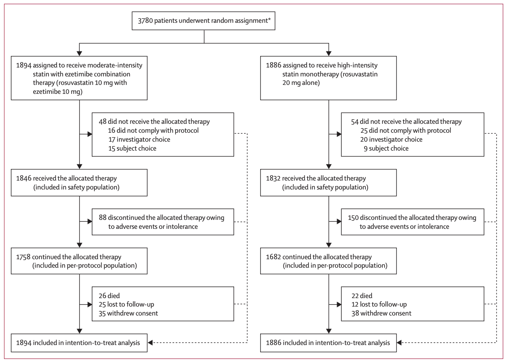
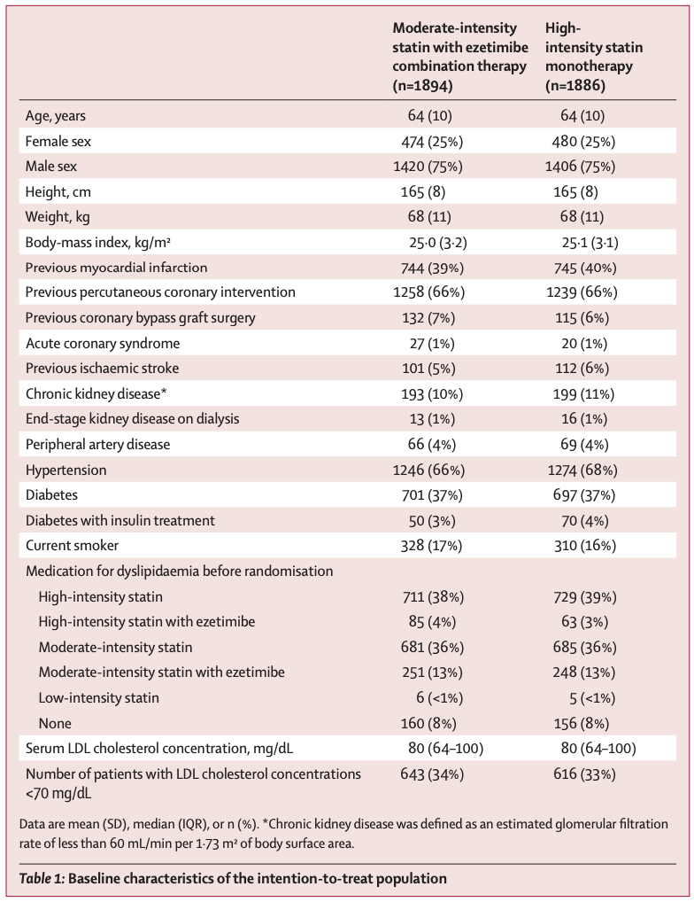
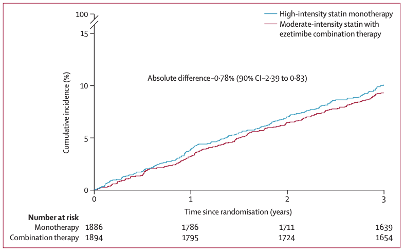
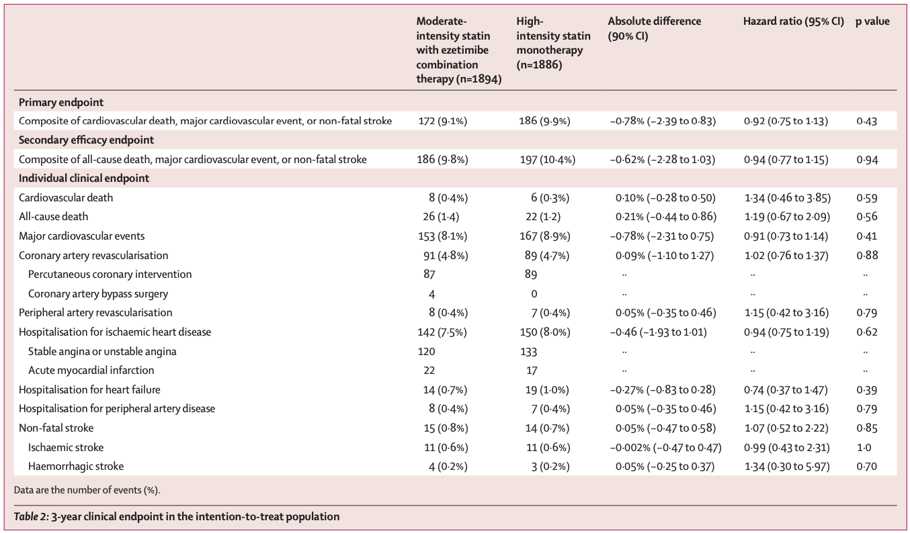
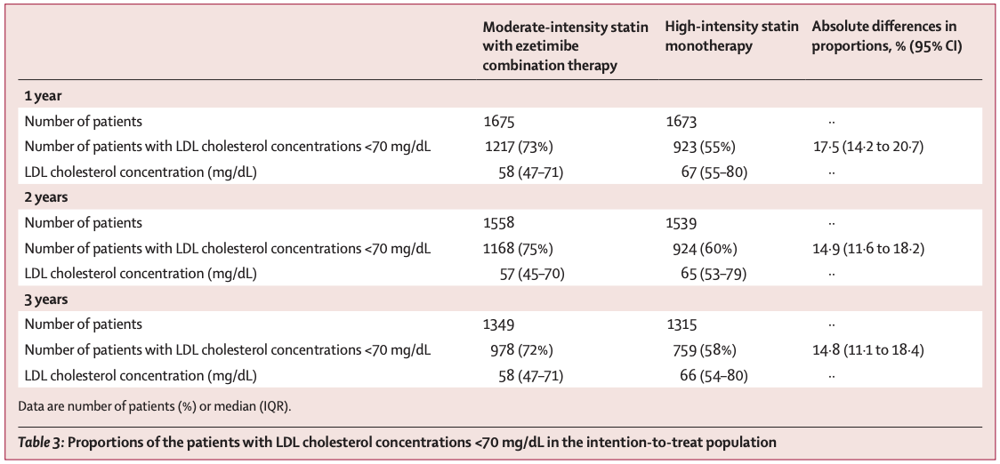

## Glossary

Atherosclerotic Cardiovascular Disease (ASCVD)

:   죽상경화성 심혈관질환. 혈관 내벽에 콜레스테롤 축적으로 인한 죽상경화증으로 발생하는 심혈관 및 뇌혈관 질환 통칭 (심근경색, 협심증, 뇌졸중, 말초혈관질환 등)

Statin / Rosuvastatin

:   간에서 HMG-CoA 환원효소를 억제하여 콜레스테롤 합성을 낮추는 대표적 고지혈증 치료제. Rosuvastatin은 고효율 스타틴 계열 전문의약품.

Ezetimibe

:   소장에서 식이성 및 담즙성 콜레스테롤 흡수를 억제하여 LDL cholesterol을 낮추는 약물. Statin과 병용 시 상가 효과 우수.

------------------------------------------------------------------------

Non-inferiority Trial (비열등성 시험)

:   새로운 치료법이 기존 표준 치료보다 효과가 열등하지 않음을 증명하는 임상시험. 신뢰구간의 상한이 비열등성 마진을 넘지 않으면 비열등성 인정.

Intention-to-Treat (ITT)

:   치료의향 분석. 무작위 배정된 모든 환자를 포함하여 분석.

## Background & Importance

-   ASCVD 환자에게는 LDL-C 목표 70mg/dL 미만(또는 55mg/dL 미만)을 위해 **고강도 스타틴 요법**이 권장됨

-   그러나 단일 약물의 용량 증가보다 **약물 병용 요법**이 더 높은 효능과 더 낮은 위험을 달성할 수 있음

    -   Ezetimibe는 스타틴과 다른 기전(장내 흡수 억제)으로 LDL-C를 추가 감소시킴
    -   스타틴 용량을 늘리지 않고도 목표 LDL-C 달성에 도움

-   기존 RCT 메타분석에서 중강도 스타틴+ezetimibe가 고강도 스타틴보다 LDL-C를 유의하게 감소시킨다는 결과가 있었으나, **장기 임상 결과를 비교한 무작위 대조 시험은 부재**

------------------------------------------------------------------------

-   **Objective** : ASCVD 환자에서 중강도 스타틴+ezetimibe 병용 요법이 고강도 스타틴 단독 요법 대비 3년 임상 결과에서 비열등한지 평가   

-   **Intervention** : Rosuvastatin 10mg + Ezetimibe 10mg (병용 요법) 또는 Rosuvastatin 20mg (고강도 단독 요법)에 1:1 무작위 배정   

-   **Primary Endpoint** : 심혈관 사망, 주요 심혈관 질환, 비치명적 뇌졸중의 3년 복합 발생률 (비열등성 한계치 2.0%p)

# Methods

## Study Design

2017/02/14 \~ 2018/12/18 한국 26개 기관에서 수행.

Multicentre / Randomized / Open-label ***Non-inferiority Trial*** ^1^

1.  두 치료군 간 primary endpoint 발생률 차이에 대한 단측 95% 신뢰구간 상한치가 2.0% 미만일 경우 비열등성이 입증된 것으로 정의. (97.5% CI 상한값도 사후 분석)

## Study Population

-   **선정기준** : 고강도 statin 치료가 필요한 ASCVD 판정 환자

    -   LDL 콜레스테롤 수치 70mg/dL 미만 유지 필요
    -   ASCVD 판정기준: 심근경색(MI) / 급성 관상동맥 증후군 / 관상동맥 재개통술 또는 동맥 혈관재형성술 이력 / 허혈성 뇌졸중 / 말초동맥질환(PAD)

-   환자들에게 고지 후 동의(informed consent) 획득

## Randomization & Procedures

-   **Randomization** : 1:1 무작위 배정. 웹 기반 순열블록 무작위배정법 사용

    -   LDL-C 100mg/dL 미만 여부 및 당뇨 유무로 계층화

-   **Procedures**

    -   Combination therapy : Rosuvastatin 10mg + Ezetimibe 10mg
    -   Monotherapy : Rosuvastatin 20mg
    -   **초기 용량 유지 원칙**

-   **추적 관찰**

    -   Endpoint 평가: 2개월, 6개월, 이후 매 1년
    -   Lipid profile: 1년, 2년, 3년에 평가
    -   부작용 평가: AST, ALT 등 정기 모니터링

## Statistical Principles

-   범주형 데이터 : 수(백분율)로 기술. 카이제곱 검정 또는 피셔의 exact test로 비교

-   연속형 데이터 : 정규분포에 따라 평균±SD 또는 중앙값(IQR)으로 기술. t-test 또는 맨-휘트니 U test로 비교

-   시간-사건 분석 : 등록 시점부터 첫 사건 발생까지 Kaplan-Meier 곡선 도출. 로그 순위 검정으로 비교, 95% CI의 HR은 Cox 회귀분석으로 추정   

**Study population**

-   주요 분석: 무작위 배정된 모든 환자를 포함하는 **ITT군**에서 수행

-   민감도 분석: 배정된 치료를 받지 않은 환자(치료 중단 기간 \> 추적기간의 5%)를 제외한 **PP군**에서 수행

-   안전성 분석: 배정된 치료를 받지 않은 환자 제외한 **안전성 분석군** 대상. 단, 불내성으로 인한 중단/용량 감량 환자는 포함

## Study Endpoint

**Primary Endpoint**

3년 내 심혈관 사망, 주요 심혈관 질환(관상동맥/말초혈관 재형성술 또는 심혈관 질환으로 인한 입원), 비치명적 뇌졸중의 복합 발생률

-   비열등성 한계치 **2.0%p**로 설정

------------------------------------------------------------------------

**Secondary Endpoints**

-   Clinical Efficacy : LDL-C \< 70mg/dL 달성 비율 (1, 2, 3년). 55mg/dL 미만 환자 비율도 사후 분석

-   Safety : 불내성으로 인한 약물 중단 또는 용량 감소, 신규 당뇨병, 근육/간/담낭 관련 부작용, 암 진단 포함

## Statistical Analyses

**1차 목적 (비열등성 검정)**

-   3년간 ITT군에서 combination therapy가 monotherapy 대비 primary endpoint 발생에서 비열등한지 확인

-   3년 예상 발생률: 병용 요법 13%, 고강도 단독 14%

-   단측 alpha 5%, 검정력 80%

    -   그룹당 1,605명 필요 + 15% 탈락 고려 → **총 3,780명**

------------------------------------------------------------------------

**비열등성 마진 2.0%p 설정 근거**

-   IMPROVE-IT 연구 (6년 추적): simvastatin-ezetimibe 32.7% vs simvastatin 34.7%

-   본 연구는 더 고강도 스타틴이므로 동일 기간 대비 더 낮은 발생률(3년 13\~14%) 추정

-   기존 메타분석: 고강도 단독 대비 병용요법에서 관상동맥 사망/심혈관 사건 **19% 상대 위험도 증가**

-   보수적 접근: 7.2%의 상대 위험도 증가(고강도 효과의 38%)를 임상적 무차이로 간주 → 이것이 그룹 간 **2.0%p 차이**에 해당

------------------------------------------------------------------------

**2차 목적 (우월성 검정)**

-   Combination therapy가 LDL-C \< 70mg/dL 달성에서 우월한지 확인

-   1차 목적이 유의미할 경우에 한해 검정

-   IMPROVE-IT 연구 기반 달성률 가정: 병용 70% vs 단독 50%

    -   양측 alpha 5%, 검정력 80%, 15% 탈락 고려 → 총 220명 필요

    -   → 1차 목적 표본 크기(3,780명)로 충분   

-   이차 평가 변수 분석은 **다중성 조정 미시행** → 탐색적 결과로 해석

-   결측치 대체법(imputation)은 사용되지 않았으며, 누락 시 동의 철회 또는 추적 소실 시점에 중도 절단 처리

-   모든 분석은 SAS 버전 9.2 사용

# Results

## Flow Diagram

## Baseline Characteristics

------------------------------------------------------------------------

2017/02/14 \~ 2018/12/18 총 3,780명 대상

-   Combination therapy **1,894명** / High-statin monotherapy **1,886명**

-   평균 연령 64세, 남성 75%

-   병력: 심근경색(MI) 40%, 경피적 관상동맥 중재술(PCI) 66%, 당뇨병 37%

-   3,622명(95.8%)이 3년 추적 관찰 완료

------------------------------------------------------------------------

**무작위 배정 전 약물 복용 현황**

|      | 고강도 스타틴 | 중강도 스타틴 | Ezetimibe 포함 중강도 |
|:----:|:-------------:|:-------------:|:---------------------:|
| 비율 |      38%      |      36%      |          13%          |

 

**배정된 치료법 복용 비율**

|                     | 1yr | 2yr | 3yr |
|:-------------------:|:---:|:---:|:---:|
| Combination therapy | 95% | 94% | 93% |
|  High-statin mono   | 94% | 91% | 90% |

-   복용 여부는 치료법 간 유의미한 차이 없음

## Primary Endpoint

|                  | Combination therapy | High-statin monotherapy |    HR (95% CI)    |  P  |
|:-----------------|:-------------------:|:-----------------------:|:-----------------:|:---:|
| **복합 종말점**  |  **172명 (9.1%)**   |    **186명 (9.9%)**     |                   |     |
| 심혈관 사망      |     8명 (0.4%)      |       6명 (0.3%)        | 1.34 (0.46\~3.85) | .59 |
| 주요 심혈관 사건 |    153명 (8.1%)     |      167명 (8.9%)       | 0.91 (0.73\~1.14) | .41 |
| 비치명적 뇌졸중  |     15명 (0.8%)     |       13명 (0.7%)       | 1.07 (0.52\~2.22) | .85 |

-   복합 종말점 절대 차이: **-0.78%p** (90% CI: -2.39% \~ 0.83%)

-   단측 95% CI 상한 0.83% \< 비열등성 마진 2.0%

    → **비열등성 충족**

-   사후 분석: 단측 97.5% CI 상한 **1.13%** \< 2.0% → 비열등성 재확인

-   개별 종말점은 모두 두 군 간 유의한 차이 없음

------------------------------------------------------------------------

**민감도 분석 (PP군)**

|             | Combination therapy | High-statin monotherapy | 절대 차이 |
|:------------|:-------------------:|:-----------------------:|:---------:|
| 복합 종말점 |    160명 (9.1%)     |      158명 (9.4%)       |  -0.29%p  |

-   사후 분석: 단측 97.5% CI 상한 **1.69%** \< 2.0%

    → PP군에서도 **비열등성 충족**

**→ Combination therapy는 고강도 스타틴 단독 요법에 비열등함**

------------------------------------------------------------------------

-   Cumulative incidence: 병용 요법이 3년 전체 기간에 걸쳐 단독 요법보다 낮거나 유사

------------------------------------------------------------------------

## Secondary Endpoint : Efficacy

**LDL-C \< 70mg/dL 달성률 (ITT군)**

| 시점 | Combination therapy | High-statin mono | 절대 차이 (95% CI) |
|:----:|:-------------------:|:----------------:|:------------------:|
| 1yr  |    1,217명 (73%)    |   923명 (55%)    | 17.5% (14.2\~20.7) |
| 2yr  |    1,168명 (75%)    |   924명 (60%)    | 14.9% (11.6\~18.2) |
| 3yr  |     978명 (72%)     |   759명 (58%)    | 14.8% (11.1\~18.4) |

-   **2차 목적 우월성 검정 결과:** 모든 시점에서 P \< 0.0001 → 병용 요법이 LDL-C 목표 달성에서 **우월**

------------------------------------------------------------------------

-   LDL-C 중앙값: 병용 요법 57\~58 mg/dL vs 단독 요법 65\~67 mg/dL

## Secondary Endpoint : Safety

**이상반응/불내성으로 인한 약물 중단 또는 용량 감소**

|                     | Combination therapy | High-statin monotherapy |       P       |
|:--------------------|:-------------------:|:-----------------------:|:-------------:|
| 중단 또는 용량 감소 |   **88명 (4.8%)**   |    **150명 (8.2%)**     | **\< 0.0001** |

-   병용 요법군에서 약물 중단/용량 감소가 **유의하게 낮음**   

-   하위집단 분석: 두 치료법의 효과는 연령, 성별, BMI, 고혈압, 당뇨, CKD, MI 이력, 뇌졸중, PAD, 기저 LDL-C 등 **모든 하위그룹에서 일관** (ITT 및 PP 집단 모두)

# Discussion

------------------------------------------------------------------------

**핵심 결과**

ASCVD 환자에서 중강도 스타틴+ezetimibe 병용 요법은 심혈관 사망, 주요 심혈관 사건, 비치명적 뇌졸중의 **3년 복합 평가지표에서 고강도 스타틴 단독 요법에 비열등**

-   LDL-C \< 70mg/dL **달성률이 유의하게 높고** (73% vs 55%, 1yr)
-   약물 불내성으로 인한 **복용 중단/용량 감량 발생률이 더 낮은** 상태에서 비열등성 입증

------------------------------------------------------------------------

### 기존 연구와의 차별점

-   IMPROVE-IT, HIJ-PROPER 등 기존 대규모 RCT는 **동일 용량 스타틴에 ezetimibe를 추가**한 효과를 평가 → 스타틴 용량 감량은 다루지 않았음

-   기존 중강도 스타틴+ezetimibe vs 고강도 스타틴 비교 RCT들은:

    -   추적 기간이 24주 내외로 **짧고**, 최대 891명으로 **적은 환자 수**
    -   LDL-C 등 **대리 표지자**를 일차 목표점으로 삼음
    -   심혈관 사망, 심근경색, 뇌졸중 등 **핵심 임상 결과 미평가**   

-   **본 연구**: 3,780명 대상, 3년 추적, 심혈관 사건을 primary endpoint로 평가한 **최초의 대규모 장기 RCT**

------------------------------------------------------------------------

### 설계 의도

-   병용 요법이 LDL-C를 더 크게 감소시킬 것으로 예상 → 우월성 연구 설계도 가능했음

-   그러나 우월성 입증을 위해서는 **훨씬 더 많은 환자가 필요**하다는 한계

-   따라서 **비열등성 시험**으로 설계

------------------------------------------------------------------------

### 임상적 의의

-   고강도 스타틴 사용 시 부작용 위험이 높거나 **스타틴 불내성** 환자에게 → 용량 증가 대신 **중강도+ezetimibe 병용을 조기에 고려** 가능

-   스타틴 불내성 관련 위험 인자: 고령, 여성, 비만, 당뇨병, 갑상선 기능저하증, 만성 간질환, 신부전   

-   병용 요법의 비열등성은 LDL-C의 유의한 감소에 기인할 수 있음

    -   메타분석: LDL-C 38.7mg/dL (1mmol/L) 감소 시 약물 종류와 무관하게 주요 혈관 사건 위험 감소
    -   Ezetimibe의 콜레스테롤 저하 외 효과 가능성: 플라크 퇴행 촉진, 염증/산화 스트레스 조절, 혈소판 응집 억제 등

------------------------------------------------------------------------

### 가이드라인 시사점

-   최근 이상지질혈증 진료지침은 LDL-C **55mg/dL 미만** + 기존 수치 대비 **50% 이상 감소**를 권고 → 스타틴 단독요법으로는 달성 어려움

-   기존 가이드라인은 최대 스타틴 단독요법에도 LDL-C가 높거나 스타틴을 견디지 못하는 경우에만 ezetimibe 사용을 권고해 왔음

-   본 연구 결과는 **중강도 스타틴에 ezetimibe를 추가하는 것을 권고하는 가이드라인의 근거를 뒷받침**

## Limitations

1.  **Open-label** 디자인 (환자/의사 모두 배정을 알고 있음)

    -   증상 보고 편향 및 노세보 효과 가능성
    -   단, 치료 배정을 모르는 **독립 위원회**가 모든 임상 사건 판정

2.  예상보다 **낮은 사건 발생률** → 2.0%p 비열등성 마진이 더 관대한 CI를 허용했을 가능성

3.  사건 수가 적어 **개별 종말점 간 비교** 어려움

## Conclusion

-   ASCVD 환자에서 중강도 스타틴+ezetimibe **병용 요법**은 고강도 스타틴 단독 요법 대비 3년 복합 종말점(심혈관 사망, 주요 심혈관 사건, 비치명적 뇌졸중)에서 **비열등**

-   병용 요법은 LDL-C \< 70mg/dL **목표 달성률이 유의하게 높고**, 약물 불내성으로 인한 **중단/감량이 더 낮음**

**→ 고강도 스타틴이 불가피했던 ASCVD 환자들에게 combination therapy를 통해 더 높은 효능과 더 낮은 위험의 치료 전략을 제시**
